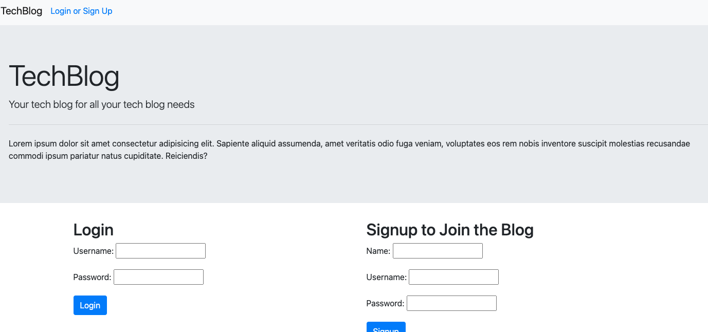
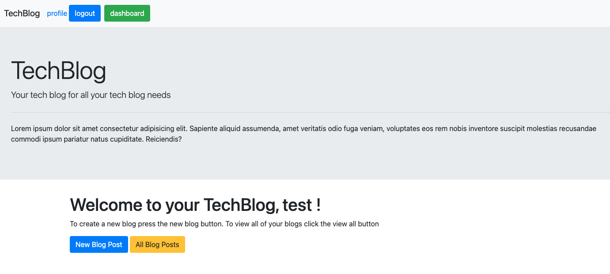
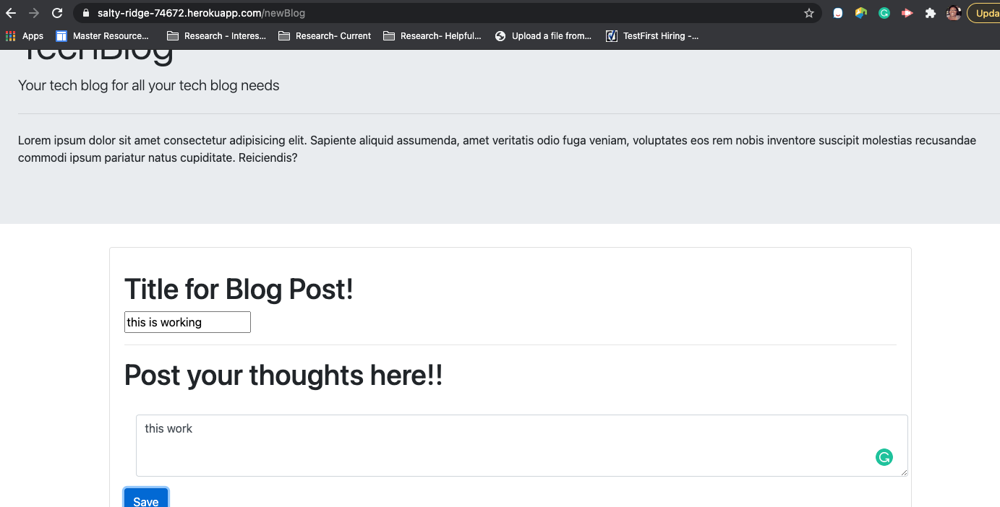

# TechBlog-MVC

Tech Blog MVC

## Description

This application should create wordpress style tech blog. Unfortunately, due technical issues, time, and being confused by one particular route. I was unable to complete the application. The application does allow the user to login, logout, signup, and create a blog which is saved to the database. The blog is not posted to the dashboard or 'allBlogs' page as I would like.

## Table of Contents

- [Installation](#installation)
- [Usage](#usage)
- [Contributing](#contributing)
- [Tests](#tests)
- [Questions](#questions)
- [License](#license)

## Installation

The page is deployed to Heroku so the user can simply follow the link and go
The project is deployed [here](https://salty-ridge-74672.herokuapp.com/)

The repo is here [here](https://github.com/jasdjames/TechBlog-MVC)

## Usage

Signup or login, click to create new post, save

## Contributing

Anyone my contribute, or give assistance on this project

## Tests

no tests were completes for this project

## Questions

Please contact me for any questions
[jasdjames]
(https://github.com/jasdjames)
jasdjames@gmail.com

## License

MIT
MIT License

    Copyright (c) [year] [fullname]

    Permission is hereby granted, free of charge, to any person obtaining a copy
    of this software and associated documentation files (the "Software"), to deal
    in the Software without restriction, including without limitation the rights
    to use, copy, modify, merge, publish, distribute, sublicense, and/or sell
    copies of the Software, and to permit persons to whom the Software is
    furnished to do so, subject to the following conditions:

    The above copyright notice and this permission notice shall be included in all
    copies or substantial portions of the Software.

    THE SOFTWARE IS PROVIDED "AS IS", WITHOUT WARRANTY OF ANY KIND, EXPRESS OR
    IMPLIED, INCLUDING BUT NOT LIMITED TO THE WARRANTIES OF MERCHANTABILITY,
    FITNESS FOR A PARTICULAR PURPOSE AND NONINFRINGEMENT. IN NO EVENT SHALL THE
    AUTHORS OR COPYRIGHT HOLDERS BE LIABLE FOR ANY CLAIM, DAMAGES OR OTHER
    LIABILITY, WHETHER IN AN ACTION OF CONTRACT, TORT OR OTHERWISE, ARISING FROM,
    OUT OF OR IN CONNECTION WITH THE SOFTWARE OR THE USE OR OTHER DEALINGS IN THE
    SOFTWARE.
